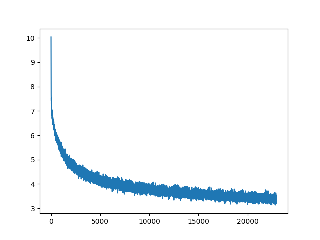
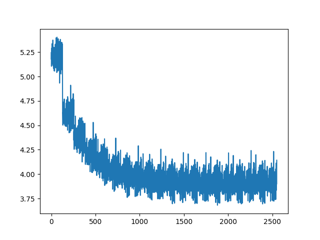
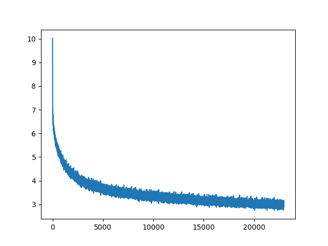
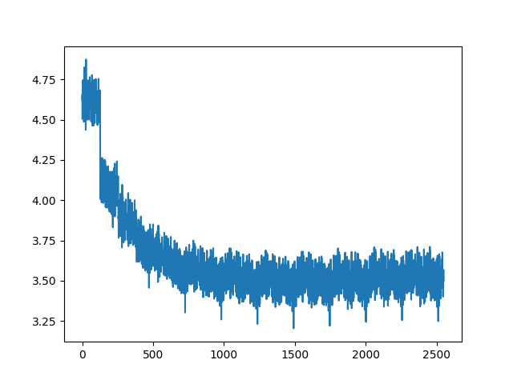

# Machine Translation
The repo targets creating simple one-to-one machine translation models, clearing the basics

Trained Model CKPT: [here](https://www.kaggle.com/datasets/krishbaisoya/machine-translation-trained-models)

I know, In this project we suffer from over-fitting. I believe increasing the weight decay to 0.01 will solve this, But I don't think it will be worth it to train all 4 models again as each took 9 hours.

## English to German

ONNX Models: [here](https://gitlab.com/KrishPro/trained-models/-/tree/main/ONNX/english-to-german)

Kaggle Notebook: [here](https://www.kaggle.com/code/krishbaisoya/machine-translation-en-de)


\
**Train Loss**


\
**Test Loss**

### Results
```
English : Hello, this sentence is quite long. The model might struggle to translate this. Let's see

German  : Hallo , dieser Satz ist ziemlich lang . Das Modell kann sich dafur kampfen . Sehen wir mal .
```

```
English : This is the second sentence. I don't like reading books, I believe articles created for specific topics are better because we don't want all of the information books have

German  : Das ist der zweite Satz . Ich mag Bucher nicht lesen , ich glaube Artikel , die fur bestimmte Themen geschaffen haben , besser sind , weil wir nicht alle Informationen bucher haben wollen .
```

## German to English

ONNX Models: [here](https://gitlab.com/KrishPro/trained-models/-/tree/main/ONNX/german-to-english)

Kaggle Notebook: [here](https://www.kaggle.com/code/krishbaisoya/machine-translation-de-en)


\
**Train Loss**


\
**Test Loss**

### Results
```
French  : Bonjour, cette phrase est assez longue. Le modèle pourrait avoir du mal à traduire cela. Voyons voir

English : Hello , that sentence is quite long . The model could have trouble translated to translate that . Let ' s see .
```

```
German  : Hallo, dieser Satz ist ziemlich lang. Das Modell könnte Schwierigkeiten haben, dies zu übersetzen Mal schauen
English : Hello , that sentence is quite long . The model could have difficulty turning this out .
```

```
German  : Dies ist der zweite Satz. Ich mag es nicht, Bücher zu lesen, ich glaube, Artikel, die für bestimmte Themen erstellt wurden, sind besser, weil wir nicht wollen, dass alle Informationsbücher enthalten sind

English : This is the second sentence . I don ' t like reading books , I think articles that have been made for certain subjects are better because we don ' t want all the information books in information .
```