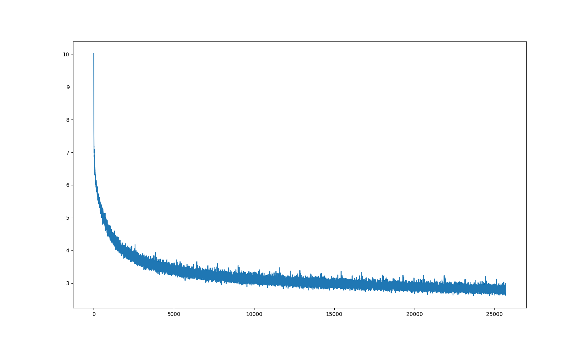
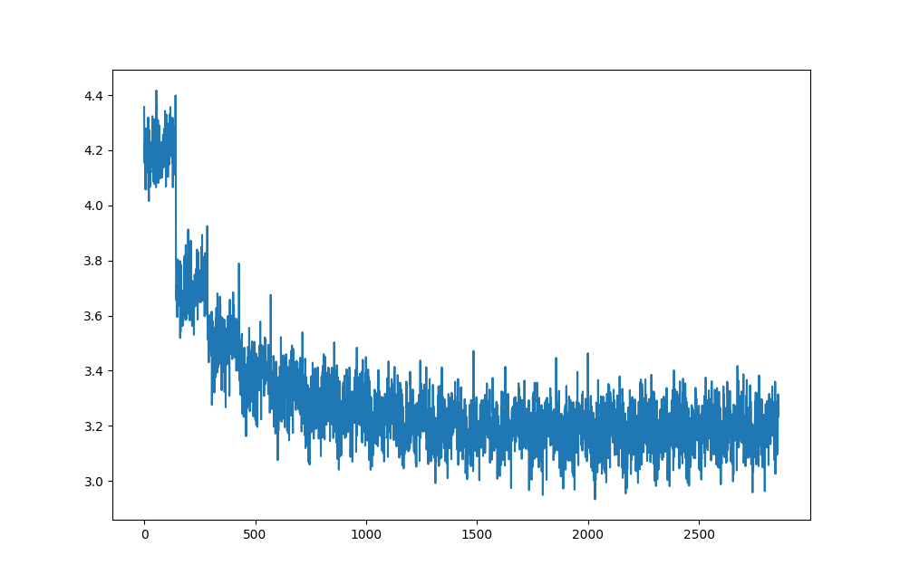
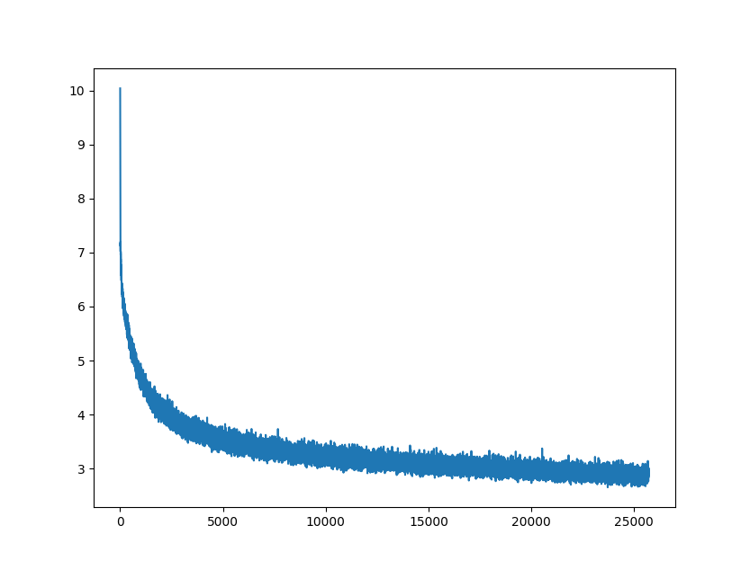
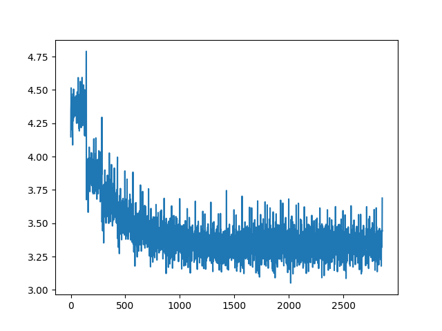

# Machine Translation
The repo targets creating simple one-to-one machine translation models, clearing the basics

Trained Model CKPT: [here](https://www.kaggle.com/datasets/krishbaisoya/machine-translation-trained-models)

I know, In this project we suffer from over-fitting. I believe increasing the weight decay to 0.01 will solve this, But I don't think it will be worth it to train all 4 models again as each took 9 hours.

## English to French

ONNX Models: [here](https://gitlab.com/KrishPro/trained-models/-/tree/main/ONNX/english-to-french)

Kaggle Notebook: [here](https://www.kaggle.com/code/krishbaisoya/machine-translation-en-fr)


\
**Train Loss**


\
**Test Loss**

### Results
```
English : Hello, this sentence is quite long. The model might struggle to translate this. Let's see

French  : Bonjour , cette phrase est assez longue . Le modele pourrait lutter pour traduire cela . Voyons voir
```

```
English : This is the second sentence. I don't like reading books, I believe articles created for specific topics are better because we don't want all of the information books have

French  : Voici la seconde phrase . Je n ' aime pas lire des livres , je crois que les articles ont cree pour des sujets specifiques , car nous ne voulons pas que tous les livres d ' information aient lieu .
```

## French to English

ONNX Models: [here](https://gitlab.com/KrishPro/trained-models/-/tree/main/ONNX/french-to-english)


Kaggle Notebook: [here](https://www.kaggle.com/code/krishbaisoya/machine-translation-fr-en)


\
**Train Loss**


\
**Test Loss**

### Results
```
French  : Bonjour, cette phrase est assez longue. Le modèle pourrait avoir du mal à traduire cela. Voyons voir

English : Hello , that sentence is quite long . The model could have trouble translated to translate that . Let ' s see .
```

```
French  : C'est la deuxième phrase. Je n'aime pas lire des livres, je pense que les articles créés pour des sujets spécifiques sont meilleurs parce que nous ne voulons pas que tous les livres d'information aient

English : It ' s the second sentence . I don ' t like reading books , I think the articles that are created for specific subjects are better because we don ' t want all the news books to be available .
```