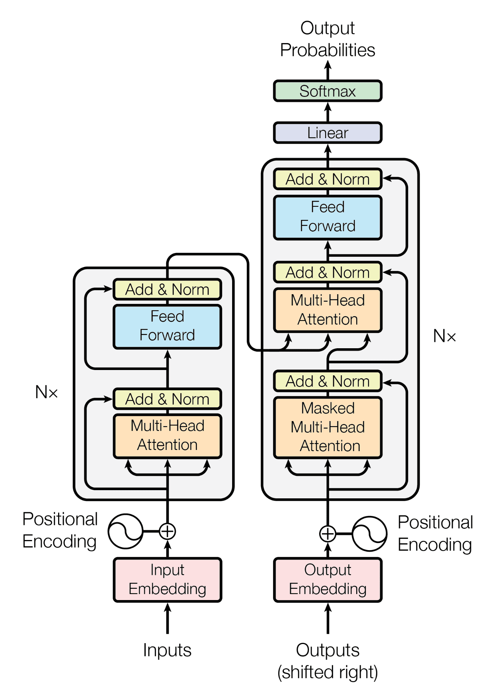

# Machine Translation
The repo targets creating simple one-to-one machine translation models, clearing the basics

## Architecture

I've used pure orignal transformer without any modifications, I have just changed the size according to my needs. I have also changed the way it is implimented because the method proposed by the research paper is quite slow. The main concept remains unchanged

You can read the [research paper](https://arxiv.org/pdf/1706.03762.pdf) for further details



## Dataset
I have used the ted talks translation dataset: IWSLT2016 ([Download from here](https://drive.google.com/uc?id=1l5y6Giag9aRPwGtuZHswh3w5v3qEz8D8))
I have multiple ted talks translated into 5 languages to reach a wider audience and we used that data to create our own translators

## Results 

I've got pretty nice results, I have targets 2 languages french and german (I mean- thier conversion to english and from english)

Use our [demo](https://github.com/KrishPro/machine-translation/tree/demo) branch, to run translations even on your machine !

**Below are some translations made by my models:**

### English to French

```
English : Hello, this sentence is quite long. The model might struggle to translate this. Let's see

French  : Bonjour , cette phrase est assez longue . Le modele pourrait lutter pour traduire cela . Voyons voir
```

```
English : This is the second sentence. I don't like reading books, I believe articles created for specific topics are better because we don't want all of the information books have

French  : Voici la seconde phrase . Je n ' aime pas lire des livres , je crois que les articles ont cree pour des sujets specifiques , car nous ne voulons pas que tous les livres d ' information aient lieu .
```


### French to English

```
French  : Bonjour, cette phrase est assez longue. Le modèle pourrait avoir du mal à traduire cela. Voyons voir

English : Hello , that sentence is quite long . The model could have trouble translated to translate that . Let ' s see .
```

```
French  : C'est la deuxième phrase. Je n'aime pas lire des livres, je pense que les articles créés pour des sujets spécifiques sont meilleurs parce que nous ne voulons pas que tous les livres d'information aient

English : It ' s the second sentence . I don ' t like reading books , I think the articles that are created for specific subjects are better because we don ' t want all the news books to be available .
```

### German to English
```
German  : Hallo, dieser Satz ist ziemlich lang. Das Modell könnte Schwierigkeiten haben, dies zu übersetzen Mal schauen

English : Hello , that sentence is quite long . The model could have difficulty turning this out .
```

```
German  : Dies ist der zweite Satz. Ich mag es nicht, Bücher zu lesen, ich glaube, Artikel, die für bestimmte Themen erstellt wurden, sind besser, weil wir nicht wollen, dass alle Informationsbücher enthalten sind

English : This is the second sentence . I don ' t like reading books , I think articles that have been made for certain subjects are better because we don ' t want all the information books in information .
```

### English to German


```
English : Hello, this sentence is quite long. The model might struggle to translate this. Let's see

German  : Hallo , dieser Satz ist ziemlich lang . Das Modell kann sich dafur kampfen . Sehen wir mal .
```

```
English : This is the second sentence. I don't like reading books, I believe articles created for specific topics are better because we don't want all of the information books have

German  : Das ist der zweite Satz . Ich mag Bucher nicht lesen , ich glaube Artikel , die fur bestimmte Themen geschaffen haben , besser sind , weil wir nicht alle Informationen bucher haben wollen .
```
